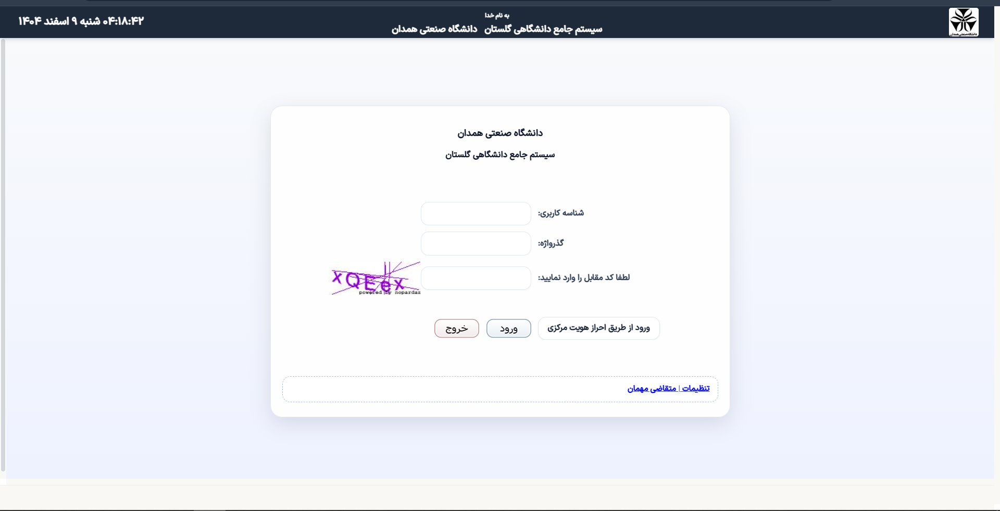

# افزونه زیبا ساز سيستم جامع دانشگاهی گلستان

مراحل نصب اکستشن زیبا ساز گلستان

چون اکستشن به حالت دولپر هست و داخل کروم استور منتشر نشده باید به این صورت نصب کنید

1- وارد اکستنشن های کروم میشوید و سپس حالت دولپر را فعال میکنیم
 
	

و بعد از آن روی load unpacked  میزنیم و سپس فایل رو انتخاب میکنیم
     (فایل اکستنشن گلستان رو داخل سیستم آنزیپ میکنیم)

	بعد از انتخاب پوشه به صفحه اکستنشن های کروم مراجعه کرده و فایل رو فعال میکنیم

تبریک زیبا ساز گلستان فعال شد و در صورت مراجعه به گلستان استایل ان بهینه میشیود

 

در صورت اختلال در درس افزار اکستنشن را خاموش کنید
